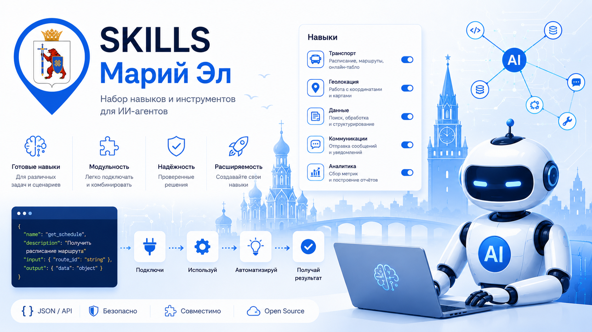

# transport12-skill



Codex skill для сопровождения проекта `transport12` и связанных репозиториев.

Skill помогает агенту быстро работать с архитектурой сервиса, API, Telegram-ботом, VK Mini App, MCP-интеграцией, локализацией, документацией и деплоем.

## Scope

Skill описывает инженерные правила и рабочие процедуры:

- граница между основным API и внешними клиентами;
- структура основного репозитория;
- правила безопасной публичной документации;
- правила локализации интерфейсов в основном сервисе;
- порядок проверки сборки и деплоя;
- API endpoints, которые должны использовать MCP и другие внешние клиенты.

Skill не должен превращаться в описание пользовательских сценариев ботов. В него намеренно не входят:

- избранное как пользовательская функция Telegram/VK;
- выбор языка и локализованные ответы как MCP/AI-сценарий;
- главное меню и кнопочные сценарии Telegram/VK.

Эти функции остаются частью основного сервиса `transport12`, а не задачей skill или MCP.

## Структура

```text
transport12/
  SKILL.md
  agents/openai.yaml
  references/api.md
```

## Установка из npm

```bash
npm pack transport12-skill
```

Пакет содержит папку `transport12/` со skill. Для локального использования скопируйте эту папку в каталог skills вашего Codex-окружения.

Пример:

```bash
npm pack transport12-skill
tar -xzf transport12-skill-*.tgz
cp -R package/transport12 ~/.codex/skills/
```

PowerShell:

```powershell
npm pack transport12-skill
tar -xzf transport12-skill-*.tgz
Copy-Item -Recurse package\transport12 $HOME\.codex\skills\transport12
```
